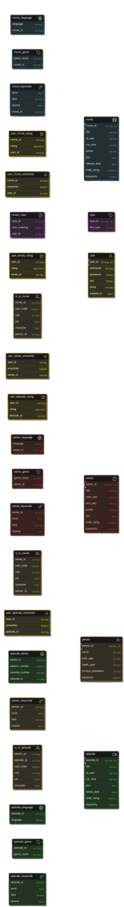

# OMGdbApi

OMGdbApi is a .NET 8.0 web API project that uses PostgreSQL as its database. This project includes Docker support for easy deployment and development.

## Installation

### Prerequisites

- [.NET 8.0 SDK](https://dotnet.microsoft.com/download/dotnet/8.0)
- [Docker](https://www.docker.com/get-started)

### Environment Variables

Create a `.env` file in the root directory with the following content:

./env_eksambel
```sh
OMGDB_POSTGRES_USER=admin
OMGDB_POSTGRES_PASSWORD=***********
OMGDB_PGADMIN_DEFAULT_EMAIL=admin@OMGDB.com
OMGDB_PGADMIN_DEFAULT_PASSWORD=***********
#For OMGDB_API
OMGDB_API_JWT_SECRET=*********
ASPNETCORE_ConnectionStrings_DefaultConnection='Host=host.docker.internal;Port=5532;Database=portf_1;Username=admin;Password=***********'
OMGDB_ASPNETCORE_Kestrel__Certificates__Default__Password=***********
#for import script both in local, docker and external
OMGDB_POSTGRES_HOST=127.0.0.1
OMGDB_POSTGRES_PORT=5432
OMGDB_USERDATABASE=portf_1
OMGDB_USER_PG=admin
PGPASSWORD=***********
```


### Building and Running the Project

1. **Make Cert**

1.a **Clean old cert**
    
```sh
dotnet dev-certs https --clean
```

1.b **Create a self-signed certificate:**

```sh
dotnet dev-certs https -ep "certs\OMGDBapp.pfx" -p <password>
```

1.c **Trust the certificate:**

```sh
dotnet dev-certs https --trust
```
1.d **Ceck certificate**
    
```sh
dotnet dev-certs https --check
```

1.d **Set the certificate password in the `.env` file:**

```sh
OMGDB_ASPNETCORE_Kestrel__Certificates__Default__Password=<password>
```

**Importent: if you change the path or cert name, change it also in compose**

2.a **Build the Docker containers:**

```sh
docker compose --env-file .env build
```

2.b **Run the Docker containers:**

```sh
docker compose --env-file .env up -d
```

3. **Access the API:**

The API will be available at `http://localhost:8080`.

4. **Access pgAdmin:**

pgAdmin will be available at `http://localhost:5550`. Use the email `admin@OMGDB.com` and the password specified in your `.env` file.


### Database Migrations

- import the database backup files to the database
(works on the docker setup, as well as on remote postgres servers, just change the env variables in the .env file)

```sh
./import.sh
```
- test import (only works on this docker_compose setup, not on remote postgres  servers* needs pgtap to work)

```sh
./test.sh
```

- Delete import files
```sh
./delete_import.sh
```

## Testing

- **Unit Tests:** Run the unit tests using the following command:

```sh
cd ./test
```
    
```sh
dotnet test
```

## Project Structure

```shellscript
.
├── .gitignore
├── OMGdbApi
│   ├── Controllers
│   │   ├── EpisodeController.cs
│   │   ├── GenericController.cs
│   │   ├── GenreController.cs
│   │   ├── MovieController.cs
│   │   ├── PersonController.cs
│   │   ├── RatingsController.cs
│   │   ├── RecentViewController.cs
│   │   ├── SeriesController.cs
│   │   ├── UserController.cs
│   │   └── WatchlistController.cs
│   ├── Models
│   │   ├── Actor.cs
│   │   ├── Episode.cs
│   │   ├── Generic
│   │   │   └── TopWeeklyTitles.cs
│   │   ├── Genre.cs
│   │   ├── GenreAll.cs
│   │   ├── Movie.cs
│   │   ├── OMGdbContext.cs
│   │   ├── Person.cs
│   │   ├── Series.cs
│   │   └── Users
│   │       ├── Ratings
│   │       │   ├── RatingALL.cs
│   │       │   ├── RatingEpisode.cs
│   │       │   ├── RatingMovie.cs
│   │       │   └── RatingSeries.cs
│   │       ├── Recent_View
│   │       │   ├── RecentView.cs
│   │       │   └── RecentViewAll.cs
│   │       ├── User.cs
│   │       ├── UserCreate.cs
│   │       ├── UserDTO.cs
│   │       ├── UserLogin.cs
│   │       └── Watchlist
│   │           ├── WatchlistAll.cs
│   │           ├── WatchlistEpisode.cs
│   │           ├── WatchlistMovie.cs
│   │           └── WatchlistSeries.cs
│   ├── OMGdbApi.csproj
│   ├── Program.cs
│   ├── Properties
│   │   └── launchSettings.json
│   ├── Service
│   │   ├── Hashing.cs
│   │   └── ValidateIDs.cs
│   ├── appsettings.Development.json
│   └── appsettings.json
├── OMGdbApi.sln
├── README.md
├── blueprint
│   ├── ER_Diagram.svg
│   └── excalidraw
│       └── main_excali.excalidraw
├── certs
├── customPostgresql.conf
├── db
│   ├── import_backup
│   ├── script
│   │   ├── create-triggers
│   │   │   ├── drop_triggers.sql
│   │   │   └── type-triggers.sql
│   │   ├── create_db
│   │   │   ├── create_db_draft1.sql
│   │   │   ├── create_db_draft2.sql
│   │   │   ├── create_db_final.sql
│   │   │   ├── drop_all.sql
│   │   │   └── import_script.sql
│   │   ├── create_indexs
│   │   │   ├── create.sql
│   │   │   └── drop.sql
│   │   ├── create_materialized_views
│   │   │   ├── create.sql
│   │   │   └── drop.sql
│   │   ├── genre_functions
│   │   │   ├── create.sql
│   │   │   └── drop.sql
│   │   ├── person_functions
│   │   │   ├── create.sql
│   │   │   └── drop.sql
│   │   ├── search_functionality
│   │   │   ├── drop_functions.sql
│   │   │   └── search_functions.sql
│   │   └── user_functions
│   │       ├── create.sql
│   │       └── drop.sql
│   └── test
│       ├── manuel_create_dumyUsr.sql
│       ├── test.sql
│       └── test_manuel.sql
├── delete_import.sh
├── docker-compose.dev.yml
├── docker-compose.yml
├── env_eksambel
├── import.sh
├── init-db.sh
├── omdb_pg_pgtap.Dockerfile
├── omddb_pg_test.Dockerfile
├── omgdb_web_api.Dockerfile
├── test
│   ├── Generic
│   │   ├── TopWeeklyTitlesApiTest.cs
│   │   └── TopWeeklyTitlesSchema.cs
│   ├── GenreTest
│   │   ├── GenreApiTest.cs
│   │   └── GenreSchema.cs
│   ├── RequestClass.cs
│   ├── TitleTest
│   │   ├── ActorSchema.cs
│   │   ├── Episode
│   │   │   ├── EpisodeApiTest.cs
│   │   │   └── EpisodeSchema.cs
│   │   ├── Movie
│   │   │   ├── MovieApiTest.cs
│   │   │   └── MovieSchema.cs
│   │   ├── Person
│   │   │   ├── PersonApiTest.cs
│   │   │   └── PersonSchema.cs
│   │   └── Series
│   │       ├── SeriesApiTest.cs
│   │       └── SeriesSchema.cs
│   ├── UserTest
│   │   ├── RatingsTest
│   │   │   ├── RatingsApiTest.cs
│   │   │   ├── RatingsEpisodeSchema.cs
│   │   │   ├── RatingsMovieSchema.cs
│   │   │   └── RatingsSeriesSchema.cs
│   │   ├── RecentViewTest
│   │   │   ├── RecentViewApiTest.cs
│   │   │   └── RecentViewSchema.cs
│   │   ├── RequestClassUser.cs
│   │   ├── UserApiTest.cs
│   │   ├── UserSchema.cs
│   │   └── WatchlistTest
│   │       ├── WatchlistApiTest.cs
│   │       ├── WatchlistEpisodeSchema.cs
│   │       ├── WatchlistMovieSchema.cs
│   │       └── WatchlistSeriesSchema.cs
│   ├── test.csproj
│   └── xunit.runner.json
└── test.sh
```

## Project Configuration

- **Dockerfile:** Defines the Docker image for the project.
- **docker-compose.yml:** Defines the Docker services for the project.
- **appsettings.Development.json:** Configuration settings for the development environment.
- **OMGdbApi.csproj:** Project file for the .NET application.
- **OMGdbItemsController.cs:** Controller for the API endpoints.
- **OMGdbContext.cd.cs:** Database context class for Entity Framework.
- **OMGdbItem.cs:** Model class for the database table.
- **OMGdbApiMigration.cs:** Database migration file for Entity Framework.
- **OMGdbApiMigration.Designer.cs:** Database migration file for Entity Framework.
- **OMGdbContextModelSnapshot.cs:** Database migration file for Entity Framework.
- **launchSettings.json:** Configuration settings for launching the application.
- **import.sh:** Script for importing the database backup files.
- **test.sh:** Script for testing the database import.
- **delete_import.sh:** Script for deleting the import files.
- **create_db_draft1.sql:** SQL script for creating the database schema.
- **create_db_draft2.sql:** SQL script for creating the database schema.
- **create_db_final.sql:** SQL script for creating the database schema.
- **import_script.sql:** SQL script for importing the database backup files.
- **type-triggers.sql:** SQL script for creating triggers on the database tables.
- **user_function.sql:** SQL script for user functionality.
- **test_users.sql:** SQL script for testing the database import.

## API Endpoints

- **GET /api/OMGdbItems:** Get all items from the database.
- **GET /api/OMGdbItems/{id}:** Get an item by ID from the database.
- **POST /api/OMGdbItems:** Add an item to the database.
- **PUT /api/OMGdbItems/{id}:** Update an item by ID in the database.
- **DELETE /api/OMGdbItems/{id}:** Delete an item by ID from the database.

## Database Schema



## Technologies

- [.NET 8.0](https://dotnet.microsoft.com/download/dotnet/8.0)
- [Entity Framework Core](https://docs.microsoft.com/en-us/ef/core/)
- [PostgreSQL](https://www.postgresql.org/)
- [Docker](https://www.docker.com/)
- [pgAdmin](https://www.pgadmin.org/)
- [Docker Compose](https://docs.docker.com/compose/)
- [Docker Hub](https://hub.docker.com/)
- [Docker Desktop](https://www.docker.com/products/docker-desktop)


## License

This project is licensed under the MIT License.
